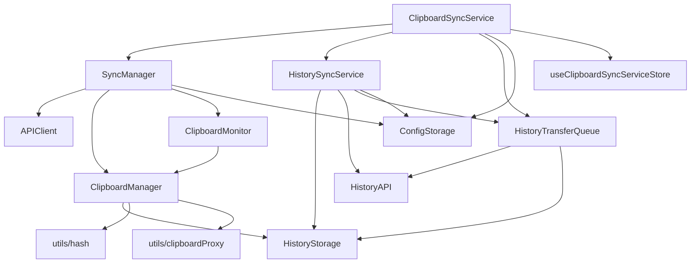
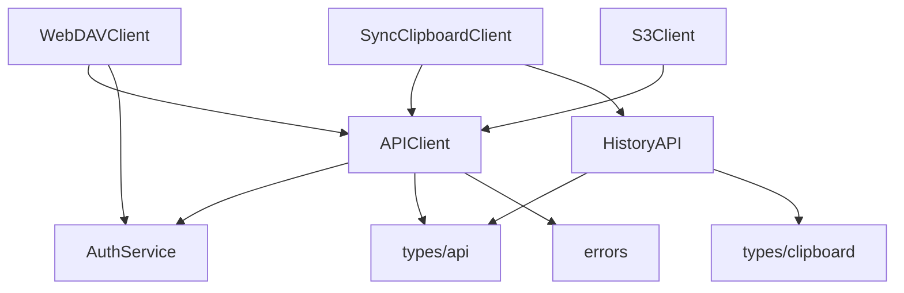
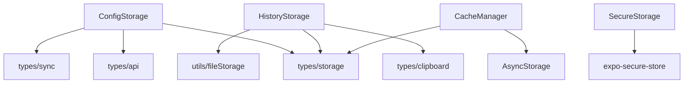

# Services 依赖关系图

## 📊 依赖关系可视化

### 核心服务依赖图



### API 客户端依赖图



### 存储服务依赖图



---

## 📋 详细依赖列表

### 1. ClipboardSyncService

**文件**: `services/ClipboardSyncService.ts`

**依赖**:

- `types/sync` - SyncDirection, SyncResult
- `types/api` - ServerConfig
- `types/clipboard` - ClipboardContent
- `services/APIClient` - ISyncClipboardAPI
- `services/SyncManager` - 同步管理器
- `services/HistorySyncService` - 历史同步服务
- `services/HistoryTransferQueue` - 传输队列
- `services/ConfigStorage` - 配置读取
- `stores/ClipboardSyncServiceStore` - 状态管理
- `stores/settingsStore` - 设置存储
- `utils/clipboard` - profileDtoToContent
- `signalr-client` - SignalR 客户端

**被依赖**:

- `App.tsx` - 启动服务
- `screens/HomeScreen` - UI 交互
- `services/BackgroundServiceManager` - 生命周期管理

---

### 2. SyncManager

**文件**: `services/SyncManager.ts`

**依赖**:

- `services/SyncClipboardClient` - SyncClipboard 客户端
- `services/APIClient` - ISyncClipboardAPI
- `services/WebDAVClient` - WebDAV 客户端
- `services/S3Client` - S3 客户端
- `services/AuthService` - 认证服务
- `services/ClipboardManager` - 剪贴板管理器
- `services/ClipboardMonitor` - 剪贴板监听器
- `services/errors` - ConfigurationError
- `types/api` - ServerConfig, ProfileDto
- `types/sync` - 同步相关类型
- `types/clipboard` - ClipboardContent
- `utils/hash` - compareHash
- `utils/index` - isTextInvalid
- `stores/settingsStore` - 设置存储

**被依赖**:

- `services/ClipboardSyncService` - 剪贴板同步
- `stores/syncStore` - 同步状态管理

---

### 3. HistorySyncService

**文件**: `services/HistorySyncService.ts`

**依赖**:

- `services/HistoryAPI` - IHistoryAPI, DTO 类型, 错误类
- `services/HistoryStorage` - 历史记录存储
- `services/HistoryTransferQueue` - 传输队列
- `services/ConfigStorage` - 配置读取
- `types/clipboard` - ClipboardItem, HistorySyncStatus
- `types/api` - ServerConfig
- `signalr-client` - SignalR 客户端

**被依赖**:

- `services/ClipboardSyncService` - 初始化和销毁
- `screens/HistoryScreen` - UI 交互

---

### 4. HistoryTransferQueue

**文件**: `services/HistoryTransferQueue.ts`

**依赖**:

- `services/HistoryAPI` - IHistoryAPI, RecordNotFoundError
- `services/HistoryStorage` - 历史记录存储
- `types/clipboard` - HistorySyncStatus
- `utils/fileStorage` - getHistoryFileDir

**被依赖**:

- `services/ClipboardSyncService` - 初始化
- `services/HistorySyncService` - 传输管理

---

### 5. ClipboardManager

**文件**: `services/ClipboardManager.ts`

**依赖**:

- `types/clipboard` - ClipboardContent
- `services/HistoryStorage` - 历史记录存储
- `utils/hash` - calculateTextHash, calculateFileHash
- `utils/index` - isTextInvalid
- `utils/clipboardProxy` - 剪贴板代理
- `utils/fileStorage` - prepareTempFilePath, CLIPBOARD_TEMP_DIR
- `expo-clipboard` - 剪贴板 API
- `expo-image-picker` - 图片选择器
- `expo-file-system` - 文件系统
- `native-util` - nativeSetClipboardImageFromFile

**被依赖**:

- `services/ClipboardMonitor` - 剪贴板监听
- `services/SyncManager` - 同步操作
- `screens/HomeScreen` - UI 交互

---

### 6. ClipboardMonitor

**文件**: `services/ClipboardMonitor.ts`

**依赖**:

- `services/ClipboardManager` - 剪贴板管理器
- `types/clipboard` - ClipboardContent, ClipboardChangeCallback
- `types/index` - ClipboardMonitorOptions
- `react-native` - AppState
- `@react-native-async-storage/async-storage` - 存储
- `native-timer` - 定时器

**被依赖**:

- `services/SyncManager` - 同步触发
- `screens/HomeScreen` - UI 交互

---

### 7. APIClient (基类)

**文件**: `services/APIClient.ts`

**依赖**:

- `services/AuthService` - 认证服务
- `services/errors` - API 错误类
- `types/api` - ProfileDto, ServerInfo
- `types/clipboard` - ClipboardContent
- `constants` - APP_NAME, APP_VERSION

**被依赖**:

- `services/SyncClipboardClient` - SyncClipboard 客户端
- `services/WebDAVClient` - WebDAV 客户端
- `services/S3Client` - S3 客户端

---

### 8. HistoryAPI (混合文件)

**文件**: `services/HistoryAPI.ts`

**依赖**:

- `types/api` - ClipboardContentType
- `types/clipboard` - ClipboardItem, HistorySyncStatus

**被依赖**:

- `services/HistorySyncService` - 历史同步
- `services/HistoryTransferQueue` - 传输队列
- `services/SyncClipboardClient` - 实现 IHistoryAPI 接口

**包含内容**:

- 类型定义: HistoryRecordDto, HistoryQueryParams, HistoryStatisticsDto
- 错误类: SyncConflictError, RecordNotFoundError
- 工具函数: dtoToClipboardItem, clipboardItemToDto, getProfileId, parseProfileId
- 常量: ProfileTypeFilter
- 接口: IHistoryAPI

---

### 9. ConfigStorage

**文件**: `services/ConfigStorage.ts`

**依赖**:

- `types/storage` - AppConfig, DEFAULT_APP_CONFIG, STORAGE_KEYS
- `types/api` - ServerConfig
- `types/sync` - SyncMode
- `@react-native-async-storage/async-storage` - 存储

**被依赖**:

- 几乎所有服务都需要配置读取

---

### 10. HistoryStorage

**文件**: `services/HistoryStorage.ts`

**依赖**:

- `types/clipboard` - ClipboardItem, HistorySyncStatus
- `types/storage` - HistoryFilter, HistorySort, STORAGE_KEYS
- `utils/fileStorage` - getHistoryFileDir
- `@react-native-async-storage/async-storage` - 存储

**被依赖**:

- `services/ClipboardManager` - 历史记录管理
- `services/HistorySyncService` - 历史同步
- `services/HistoryTransferQueue` - 传输管理
- `screens/HistoryScreen` - UI 交互

---

## 🔄 循环依赖检测

### 当前没有循环依赖

经过分析，当前代码库没有明显的循环依赖问题。依赖关系呈现单向流动：

```
UI Layer (screens)
    ↓
Service Layer (services)
    ↓
Storage Layer (storage)
    ↓
Utils Layer (utils)
    ↓
Types Layer (types)
```

### 潜在的循环依赖风险

虽然当前没有循环依赖，但以下情况需要警惕：

1. **Service ↔ Store 依赖**

   - Service 读取 Store 状态
   - Store 调用 Service 方法
   - **解决方案**: 使用单向数据流，Store 只存储状态，Service 负责业务逻辑

2. **Service ↔ Service 依赖**
   - `ClipboardSyncService` ↔ `SyncManager`
   - **当前状态**: 单向依赖（ClipboardSyncService → SyncManager）
   - **风险**: 如果 SyncManager 需要调用 ClipboardSyncService，会产生循环依赖

---

## 📊 依赖复杂度评分

| 服务                 | 依赖数量 | 被依赖数量 | 复杂度评分 | 建议     |
| -------------------- | -------- | ---------- | ---------- | -------- |
| ClipboardSyncService | 12+      | 3          | ⭐⭐⭐⭐⭐ | 需要拆分 |
| SyncManager          | 15+      | 2          | ⭐⭐⭐⭐⭐ | 需要拆分 |
| HistorySyncService   | 7+       | 2          | ⭐⭐⭐⭐   | 可接受   |
| HistoryTransferQueue | 4+       | 2          | ⭐⭐⭐     | 良好     |
| ClipboardManager     | 9+       | 3          | ⭐⭐⭐⭐   | 可接受   |
| ClipboardMonitor     | 6+       | 2          | ⭐⭐⭐     | 良好     |
| APIClient            | 5+       | 3          | ⭐⭐⭐     | 良好     |
| HistoryAPI           | 2+       | 3          | ⭐⭐⭐⭐   | 需要拆分 |
| ConfigStorage        | 4+       | 10+        | ⭐⭐       | 良好     |
| HistoryStorage       | 4+       | 4          | ⭐⭐⭐     | 良好     |

**评分说明**:

- ⭐⭐: 简单，依赖清晰
- ⭐⭐⭐: 中等，可接受
- ⭐⭐⭐⭐: 复杂，需要关注
- ⭐⭐⭐⭐⭐: 非常复杂，需要重构

---

## 🎯 重构优先级

基于依赖复杂度评分，建议重构优先级：

1. **高优先级** (⭐⭐⭐⭐⭐)

   - ClipboardSyncService - 拆分为多个子服务
   - SyncManager - 简化依赖关系

2. **中优先级** (⭐⭐⭐⭐)

   - HistorySyncService - 优化依赖
   - HistoryAPI - 拆分混合文件
   - ClipboardManager - 优化依赖

3. **低优先级** (⭐⭐⭐ 及以下)
   - 其他服务 - 保持现状或小幅优化

---

## 📝 重构建议

### 1. 拆分 ClipboardSyncService

**当前问题**: 职责过多，依赖复杂

**建议拆分**:

```
ClipboardSyncService (协调者)
├── RemoteClipboardFetcher (远程剪贴板获取)
├── LocalClipboardWatcher (本地剪贴板监听)
├── AutoSyncManager (自动同步管理)
└── SignalRManager (SignalR 连接管理)
```

### 2. 简化 SyncManager

**当前问题**: 包含太多客户端依赖

**建议**:

- 使用依赖注入，在运行时注入需要的客户端
- 将客户端创建逻辑移到工厂函数

### 3. 拆分 HistoryAPI

**当前问题**: 混合了类型、错误、工具函数

**建议**: 参见 REFACTORING_PLAN.md 阶段 3.1

---

**最后更新**: 2026-05-05
